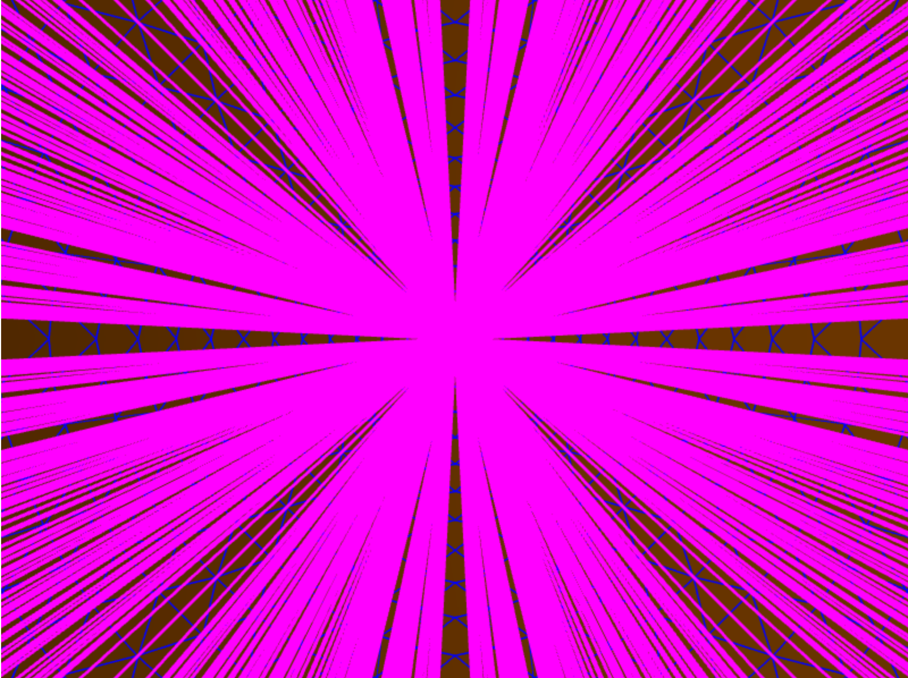
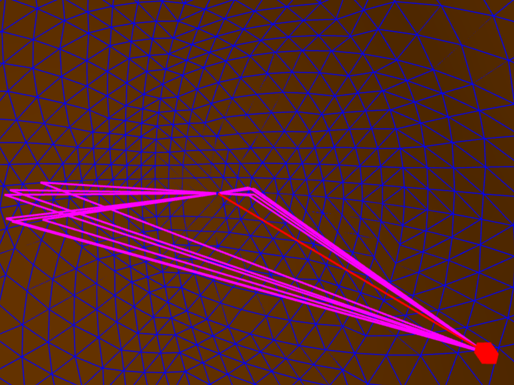

===============
CS290Assignment1
================
Aaron Liberatore
Weston Carvalho

## Image Source Generation ##
For the image source generation section, we ran a simple for loop on the given order that would call our recursive helper function, computeImageSourcesHelper, on every node where itself has an order = order-1. In computeImageSourcesHelper, the code would simply recursively iterate through the scene graph, to calculate the new image sources over every face not equal to the generation face. There are no known bugs.

## Path Extraction ##
For path extraction, we first check to see if there is an uninterrupted path form source to receiver. This is true if and only if there is no intersection along the vector from source to receiver or the intersection has a t > 1.

Following this we loop through our scene.imsources running `extractPathsHelper` on every source node to recursively backtrack to find paths.

In our recursive function, we take in two nodes startNode and endNode, a subpath array, the current impulse, and the current total distance of the path.

This finds the vector from end to start. Our base case is if the startNode == scene.source. If this is the case, we only need to check if there is an unexpected intersection. If there isn't an intersection or the intersection is >= 1 (To allow the source to start on a face) then the recursively created subpath is added to our scene.paths and an array [impulse, totalDist] is pushed onto our own scene.impulses variable.

Otherwise, we calculate the tToBouncePt (t along vector from endNode to startNode.genFace) and the minimum intersection on the vector from endNode to startNode. If there is no tToBouncePt and its between 0 and 1 AND either the intersect is null or > tToBouncePt, then this new bounce point is part of path. We create an intermediate node at the bounce point then recursively call ourselves with our bounce point and its parent along with the updated impulse scalar and total distance.

Our rayIntersectPolygon, checks if the point is in the polygon by using the area method.

There are no known bugs.
## Impulse Response Generation ##
Since, we already calculated the total length of paths and their respective impulse scalars (rcoeffs and 1/1+r^p), we can simply iterate through this array and calculate the sample number based on the totalDistance then update the scene.impulseResp array where the sample number index = scalar we calculated earlier. By calculating the scalars and path distances during the path extraction section, we save significant processing time.

## Hierarchical Rotations ##
For this section, we decided to create a new scene file called `hierarchicalRotations.scn` where we have an initial 2x2x2 box, which has a 2/3 size child above it rotated 60 degrees, which has its own child modified in the same way, and so on recursively.

## Reverberation Effect ##
It probably would have been simpler to create two scene files with a single box.off mesh of different rcoeffs, but we chose to make a single scene file `reverb.scn` which itself has two separate, but connected rooms. In the first room, the walls all have an rcoeff = 1 having sounds that are much more echoy compared to the room with a low rcoeff <= 0.2.

## Near vs Far ##
When the city scale is small sounds are loader compared to when the city is scaled higher. More sound is lost
by the radial energy spreading as the length of the path goes up.

## Ellipsoid ##

#### Calculations #####

a = 10 b = 7 c =7
x' = ax
y' = by
z' = cz
(z')2 / 100 + (y')2 / 49 + (z')2 / 49 = 1

100x2 / 100 + 49y2 / 49 = 1

a^2 - c^2 = b^2
100 - c^2 = 49
100-49 = c^2
51 = 7.14

Foci: (7.14,0,0) and (-7.14,0,0)

#### Results #####
When the paths are drawn with the source and the receiver set to the two foci of the ellipse, it appears as though there are 1 order bounces from every face to the other foci. It becomes incredibly hard to actually see anything because of all the paths. Below is a clearer view from the source itself.

Despite there being a path from source to receiver off everyface of the ellipsoid when each is at the foci, if you move the source/receiver over by merely a couple meters there are only a few paths.

## Bounding Box ##

Whenever a new scene file is created, our program creates a new tree containing bounded boxes and the meshes themselves by recursively iterating over the scene file and creating a new box for every element and combining boxes.
